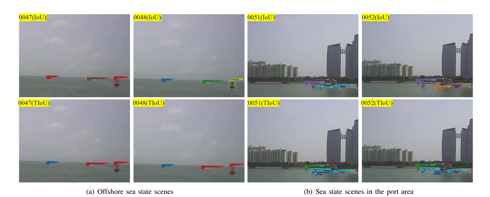
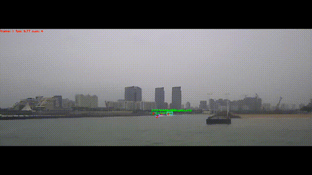
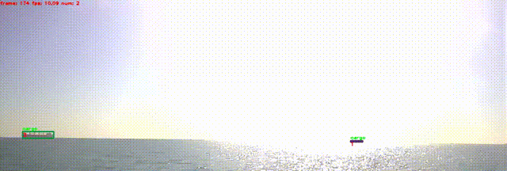

# TIoU_Tracking

<!-- [](https://paperswithcode.com/sota/multi-object-tracking-on-mot17?p=bytetrack-multi-object-tracking-by-1)

[](https://paperswithcode.com/sota/multi-object-tracking-on-mot20-1?p=bytetrack-multi-object-tracking-by-1) -->

#### MotionTrack is a simple but effective multi-object tracker for unmanned surface vehicle videos.

<p align="center"></p>IoU

<!-- > **MotionTrack: Rethinking the Motion Cue for Multiple Object Tracking in USV Videos**
> Zhenqi Liang, Gang Xiao, Jianqiu Hu, Jingshi Wang, Chunshan Ding
> -->
>  <!-- ## Demo Links
| Google Colab demo | Huggingface Demo | Original Paper: ByteTrack |
|:-:|:-:|:-:|
|[](https://colab.research.google.com/drive/1bDilg4cmXFa8HCKHbsZ_p16p0vrhLyu0?usp=sharing)|[](https://huggingface.co/spaces/akhaliq/bytetrack)|[arXiv 2110.06864](https://arxiv.org/abs/2110.06864)|
* Integrated to [Huggingface Spaces](https://huggingface.co/spaces) with [Gradio](https://github.com/gradio-app/gradio). -->


## Abstract
Multi-ship tracking (MST) as a core technology has been proven to be applied to situational awareness at sea and the development of a navigational system for autonomous ships. Despite impressive tracking outcomes achieved by multiobject tracking (MOT) algorithms for pedestrian and vehicle datasets, these models and techniques exhibit poor performance when applied to ship datasets. Intersection of Union (IoU) is the most popular metric for computing similarity used in object tracking. The low frame rates and severe image shake caused by wave turbulence in ship datasets often result in minimal, or even zero, Intersection of Union (IoU) between the predicted and detected bounding boxes. This issue contributes to frequent identity switches of tracked objects, undermining the tracking performance. In this paper, we address the weaknesses of IoU by incorporating the smallest convex shapes that enclose both the predicted and detected bounding boxes. The calculation of the tracking version of IoU (TIoU) metric considers not only the size of the overlapping area between the detection bounding box and the prediction box, but also the similarity of their shapes. Through the integration of the TIoU into state-of-the-art object tracking frameworks, such as DeepSort and ByteTrack, we consistently achieve improvements in the tracking performance of these frameworks.
<p align="center"></p>IoU

<!-- ## News -->
<!-- * (2022.07) Our paper is accepted by ECCV 2022!

* (2022.06) A [nice re-implementation](https://github.com/PaddlePaddle/PaddleDetection/tree/develop/configs/mot/bytetrack) by Baidu [PaddleDetection](https://github.com/PaddlePaddle/PaddleDetection)! -->

## Tracking performance
### Results on JMT2022 test1 dataset
| Methods    |  MOTA | IDF1 | MOTP | ML | FP |
|------------|-------|------|------|-------|-------|
|SORT          | 36.2 | 20.04 | 20.3 | 146 | 6251 |
|DEEPSORT     | 28.2 | 19.0 | 20.9 | 122 | 8303 |
|OCSORSORT   | 41.6 | 37.3 | 20.9 | 118 | 8379 |
|BYTETRACK | 42.3 | 44.7 | 21.3 | 151 | 9961 |

### Visualization results on JMT2022 test1 dataset
   
   

## Installation
### Installing on the host machine
Step1. Install TIoU_Tracking.
```shell
https://github.com/heuyu980817/TIoU_TRACKING-ship.git
cd TIoU_TRACKING-ship
pip3 install -r requirements.txt
```

Step2. Install [pycocotools](https://github.com/cocodataset/cocoapi).

```shell
pip3 install cython; pip3 install 'git+https://github.com/cocodataset/cocoapi.git#subdirectory=PythonAPI'
```

Step3. Others
```shell
pip3 install cython_bbox
```

## Data preparation

Download [JMT2022](https://github.com/hjq3659/Jari-Maritime-Tracking-Dataset.git) and organize it into the following structure:
```
jmt2022
   |——————images
            └——————train
                      └——————seq_folder
            └——————test1
```

Then, you need to turn the datasets to YOLO format. Remember to change the path in [jmt2yolo.py](tools/jmt2yolo.py) to your own first:

```shell
cd <TIoU_TRACKING-ship_HOME>
python3 tools/jmt2yolo.py
```
And then you will get a file structure like this,:
```
JMT2022
   |——————images
   |        └——————train
   |                   └——————img_file(*.jpg)
   |        └——————test1
   |——————labels
   |        └——————train
   |                   └——————label_file(*.txt)
   |        └——————test1
```
you may need to manually create some folder in JMT2022 folder.

## Model zoo

### JMT2022 test model

Train on JMT2022 train split set, evaluate on JMT2022 test1 split set.

| Model    |  MOTA | IDF1 | S | Time(ms) |
|------------|-------|------|------|------|
|tiny-640 [[google]](https://drive.google.com/file/d/1M7VpCRRe1DWcKkF74himE1JOkeDs2wgG/view?usp=sharing), [[baidu(code:u0ds)]](https://pan.baidu.com/s/1ABVrRp5trBKcnP2PGdYfKg) | 21.7 | 30.2 | 22.4 | 1.7+1.3 |
|tiny-960 [[google]](https://drive.google.com/file/d/1o6FCz9tLdJrHCEVQVXXMUQSclyFEOJJk/view?usp=sharing), [[baidu(code:m1pa)]](https://pan.baidu.com/s/1V_7YMOxeJ0UqAKgt7QdvOw) | 40.4 | 44.0 | 37.3 | 4.9+1.4 |
|tiny-1920 [[google]](https://drive.google.com/file/d/1fJYMRqkc2XKJqVwm9HuBdigebBZvktXU/view?usp=sharing), [[baidu(code:ga2m)]](https://pan.baidu.com/s/1LpzYkFgA2NEF9ZeegaQ1Jg) | 45.2 | 47.8 | 43.3 | 10.2+1.5 |
|W6-1920 [[google]](https://drive.google.com/file/d/1pBZf1Y3dcOE3Kk4g0hARWvY6tp2ivtMu/view?usp=sharing), [[baidu(code:ecnv)]](https://pan.baidu.com/s/19pmn3xAdHKHuCNGkhiYPeg) | 46.9 | 49.2 | 44.4 | 26.9+1.5 |

## Training

The COCO pretrained YOLOv7-W6 and YOLOv7-tiny model can be downloaded from their [model zoo](https://github.com/WongKinYiu/yolov7/releases). After downloading the pretrained models, you can put them under <TIoU_TRACKING-ship_HOME>/pretrain. You may need to change the path of the [jmt2022.yaml](data/jmt2022.yaml) to point to your own (ie. train, val, and test).

* **Single GPU training**

```shell
cd <TIoU_TRACKING-ship_HOME>
# train W6 models
python3 tools/train_aux.py --workers 8 --device 0 --batch-size 5  --data data/jmt2022.yaml --cfg cfg/training/yolov7-w6.yaml --name yolov7-w6  --hyp data/hyp.jmt2022.p6.yaml --weights 'pretrain/yolov7-w6.pt'
# train tiny models
python3 tools/train.py --workers 8 --device 0 --batch-size 20  --data data/jmt2022.yaml --cfg cfg/training/yolov7-tiny.yaml --name yolov7-tiny  --hyp data/hyp.jmt2022.tiny.yaml --weights 'pretrain/yolov7-tiny.pt'
```
* **Multiple GPU training**

```shell
cd <TIoU_TRACKING-ship_HOME>
# train W6 modelsTIoU
python -m torch.distributed.launch --nproc_per_node 4 --master_port 9527 tools/train_aux.py --workers 8 --device 0,1,2,3 --sync-bn --batch-size 20  --data data/jmt2022.yaml --cfg cfg/training/yolov7-w6.yaml --name yolov7-w6  --hyp data/hyp.jmt2022.p6.yaml --weights 'pretrain/yolov7-w6.pt'
# train tiny models
python -m torch.distributed.launch --nproc_per_node 4 --master_port 9527 tools/train.py --workers 8 --device 0,1,2,3 --sync-bn --batch-size 100  --data data/jmt2022.yaml --cfg cfg/training/yolov7-tiny.yaml --name yolov7-tiny  --hyp data/hyp.jmt2022.tiny.yaml --weights 'pretrain/yolov7-tiny.pt'
```

## Tracking

* **Test on JMT2022**

```shell
cd <TIoU_TRACKING-ship_HOME>
python3 tools/track.py --weights 'path/to/W6-1920.pt' --data_root "path/to/jmt2022/images/test1"
```

## TIoUEvaluation

* **Evaluation ignoring the category (Single class)**
```shell
cd <TIoU_TRACKING-ship_HOME>
# You may need to change the path of the script to point to your own (ie. data_root and result_root).
python3 tools/evalsc.py
```
You can get 46.9 MOTA and 49.2 IDF1 using the tracking results of pretrained W6-1920 model, or you can just use the results we provide in [w6-1920-motion-140](assets/w6-1920-motion-140).
* **Evaluation considering the category (Multiple  class)**
```shell
TIoUcd <TIoU_TRACKING-ship_HOME>
# You may need to change the path of the script to point to your own (ie. data_root and result_root).
python3 tools/evalmc.py
```
You can get 44.4 S using the tracking results of pretrained W6-1920 model, or you can just use the results we provide in [w6-1920-motion-140](assets/w6-1920-motion-140).

<!-- ## Demo -->
<!-- 

```shell
cd <TIoU_TRACKING-ship_HOME>
python3 tools/demo_track.py video -f exps/example/mot/yolox_x_mix_det.py -c pretrained/bytetrack_x_mot17.pth.tar --fp16 --fuse --save_result 
```
-->

## Deploy
* **Export ONNX with NMS**

```shell
cd <TIoU_TRACKING-ship_HOME>TIoUTIoU
# export W6 models
python3 tools/export.py --weights 'path/to/W6-1920.pt' --grid --end2end --simplify \
        --topk-all 100 --iou-thres 0.65 --conf-thres 0.1
# export tiny models
python3 tools/export.py --weights 'path/to/tiny-960.pt' --grid --end2end --simplify \
        --topk-all 100 --iou-thres 0.65 --conf-thres 0.1
```
* **TensorRT in Cpp**

The relevant CPP code will be announced later. Stay tuned!
<!-- ## Citation -->
<!-- ```
@article{zhao2023TIoUtrack,
  title={Multi-Ship Tracking by Robust Similarity metric},
  author={Hongyu Zhao, Gongming Wei, Yang Xiao, Xianglei Xing},
  booktitle={},TIoU
  year={}
}

``` -->
## Acknowledgements
A large part of the code is borrowed from the previous outstanding work. Many thanks for their wonderful works.
* [https://github.com/WongKinYiu/yolov7](https://github.com/WongKinYiu/yolov7)
* [https://github.com/ifzhang/ByteTrack](https://github.com/ifzhang/ByteTrack)
* [https://github.com/CaptainEven/MCMOT-ByteTrack](https://github.com/CaptainEven/MCMOT-ByteTrack)
